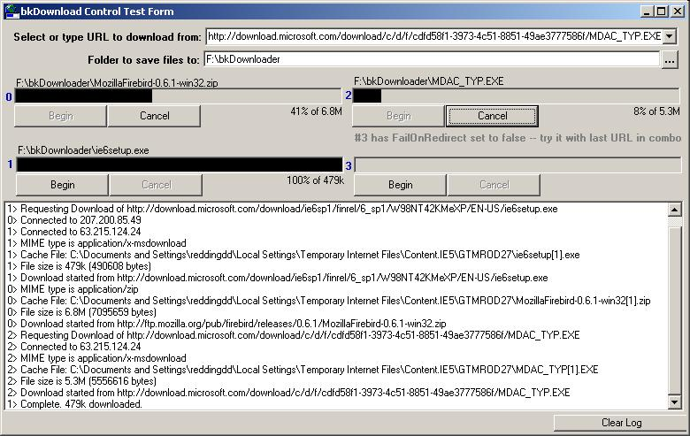



## UPDATED \- Download Control \(without Winsock\)  v2\.1

### Description

I wanted a quick way to add the ability to retrieve files over the 'net w/o adding extra files to the distribution. Found an example here by Chloe that used the AsyncRead functions of a user control. I didn't really think that control went far enough, so I wrote this new one with lots more flexibility.

This is also a visible control which acts like it's own progress bar on the form (nothing fancy, there are plenty of PB examples here if you wanna soup it up.) It's also pretty smart about file names and can automatically halt the DL if redirected (say, to a 404.html file.) Just thrown in are my own functions for collapsing a path (replace some folders with ...) to fit a given space and returning a formatted size in b, k, M or G given a # of bytes.

Thanks also to Mr. Bobo - I threw his Browse for Folder routine in just so I wouldn't have to add the common dialog to the demo form (not actually used in DL control.)

Hope you all find this useful, I know I will! ;-)

NEW TO UPDATED V2:

- Option to Rename save file if redirected

- Properties to retrive download information outside of the events

- Option to wait till download complete before returning to main form code.

Possible uses:

- Have program check for updates over net

- Get changeable content (news/blogs/tips/ads/etc)

- Retrieve customized batch files
 
### More Info
 
This is a download user control. If you are voting, vote on the control, not the demo project. The demo project was thrown together to show off the features, it isn't really a practical complete application in itself.

Assumes a live connection. Download fails immediately if connection not available.

             |
---                |---
**Submitted On**   |2003-09-18 14:25:04
**By**             |[Dan Redding \- Blue Knot Software](https://github.com/Planet-Source-Code/PSCIndex/blob/master/ByAuthor/dan-redding-blue-knot-software.md)
**Level**          |Intermediate
**User Rating**    |4.9 (34 globes from 7 users)
**Compatibility**  |VB 5\.0, VB 6\.0
**Category**       |[Internet/ HTML](https://github.com/Planet-Source-Code/PSCIndex/blob/master/ByCategory/internet-html__1-34.md)
**World**          |[Visual Basic](https://github.com/Planet-Source-Code/PSCIndex/blob/master/ByWorld/visual-basic.md)
**Archive File**   |[UPDATED\_\-\_1647089182003\.zip](https://github.com/Planet-Source-Code/dan-redding-blue-knot-software-updated-download-control-without-winsock-v2-1__1-48440/archive/master.zip)

